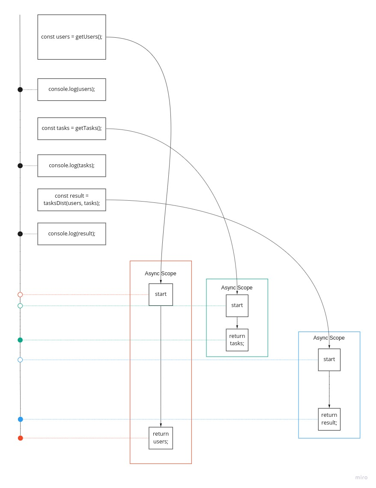
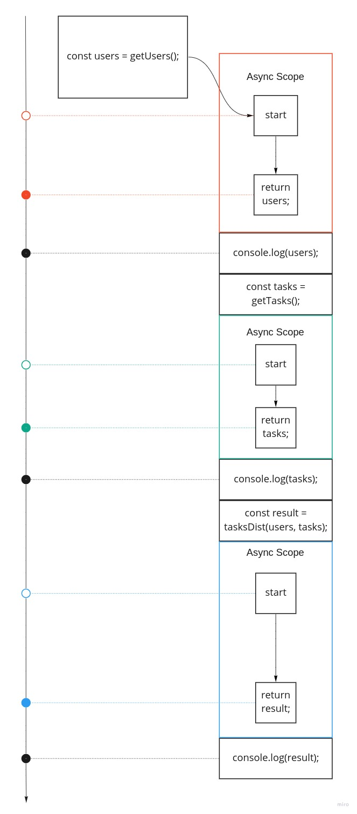

### Этот гайд написан как предисловие к изучению промисов на примере работы [waterfall](https://caolan.github.io/async/v3/waterfall.js.html)

Прежде чем затронуть тему промисов, нужно понять саму идею как они работают. Когда мы пишем обычный код(не асинхронный) мы просто пишем команды друг за другом, в таком же порядке они вызываются.

Предположим у нас есть 3 функции. Функция `getUsers()` возвращает список пользователей, `getTasks()` возвращает список задач, а функция `tasksDist()` распределяет все задачи между пользователями, возвращая в качестве результата тот же список задач, но уже с указаными исполнителями.

В обычном(не асинхронном) коде мы бы просто вызывали функции на каждой строке и получали сразу результат:

```javascript
const users = getUsers();
console.log(users); // => [{ login: 'first@google.com', id: 1, ... }, { login: 'second@google.com', id: 2, ... }]
const tasks = getTasks();
console.log(tasks); // => [{ name: 'Написать статью по асинхронному коду', id: 1, ... }, { name: 'Исправить баги в 2 проекте', id: 2, ... }]
const result = tasksDist(users, tasks);
console.log(result); // => [{ name: 'Написать статью по асинхронному коду', id: 1, assigned: 1 ... }, { name: 'Исправить баги в 2 проекте', id: 2, assigned: 2 ... }]
```

Если представить мысленно порядок работы такого кода, то можно выстроить такую структуру:


Теперь предположим что функции `getUsers()`, `getTasks()` и `tasksDist()` ассинхронные, а код мы не меняем. В таком случае порядок меняется. Каждый вызов асинхронной функции переносит выполнения кода в этой функции в "отдельную временную ветку". В этом основная сложность понимания у новичков: код начинает работать совершенно не так, как мы привыкли до этого. Мы как Нео проснувшийся из матрицы, обнаруживаем совершенно другой мир скрывавшийся в привычных нам вещам. Давайте представим как это будет выглядеть теперь на нашей схеме:


Обратите внимание что каждый вызов асинхронной функции выполняется в своём скоупе. И каждый такой вызов может работать сколько угодно времени, мы никак заранее не можем сказать с уверенность, что при таком вызове функций например функция `getUsers()` выполнится и вернёт результат до того, как начнёт выполнение `tasksDist()`:


Для удобства я выделил выполнение каждой функции цветом и добавил направляющую времени.

Функция `getUsers()` не смотря на то, что вызвалась самой первой, завершила своё выполнение самой последней. А ведь её результат нам нужен для выполнения `tasksDist()`! Неразбериху вносит ещё и наш синхронный код, к которому мы так привыкли. В этом примере наши функции `console.log()` выполняются как обычно по порядку, но не дожидаясь выполнения асинхронных функций. Но картинка эта не совсем соответствует действительности. Во первых, если возникла связь с многопоточностью и таким выполнением - отбросьте эту мысль. Здесь выполнение функций никак не связано с многопоточностью. Рантайм выполняется в однопоточном режиме. Во-вторых [вспоминаем урок про Event Loop](https://ru.hexlet.io/courses/js-asynchronous-programming/lessons/event-loop/theory_unit) - код попадает в очередь выполнения. Поэтому сначала выполниться синхронный код, и только потом начнёт выполняться ассинхронный:



Такое представление уже ближе к реальности. Ещё немного и мы хакнем эту матрицу и начнём использовать её себе во благо.

Представив такую картину, уже могут прийти на ум какие-то способы её решения. Нам нужно как-то приостановить вызов какого-то кода, до завершения выполнения другого кода. В нашем примере функция `tasksDist()` должна выполниться только после выполнения `getUsers()` и `getTasks()`, так как её нужны данные которые вернут эти функции, а раз они ещё не выполнились то и данных ещё нет.

Хорошая новость: нам не нужно ничего придумывать с высчитыванием времени паузы или что-то в этом роде. Самый простой способ - это передать нашу функцию `tasksDist()` в качестве колбека. Сложность только в том, что мы не знаем какая из функций `getUsers()` или `getTasks()` выполнится раньше, а какая позже, то есть в какую из них нам передавать колбек. В принципе этот вопрос решается. Но колбеки несут другой негативный характер - они просто не удобны. Есть даже такое понятие [Callback Hell](http://callbackhell.ru/). Для упрощения в нашем примере сделаем чтобы сначала выполнился `getUsers()`, после него `getTasks()` и вконце `tasksDist()`:

```javascript
getUsers((users) => {
  console.log(users);
  getTasks((tasks) => {
    console.log(tasks);
    tasksDist(users, tasks, (result) => {
      console.log(result);
    });
  });
});
```

А на нашей схеме такое выполнение можно было бы представить в таком виде:



Такое выполнение уже более удобно для работы, все функции выполняются последовательно друг за другом. Но код с колбеками ужасно неудобен. Представьте что мы написали такую функцию. Чтобы пользователю можно было работать с конечным результатом, ему нужно пробросить свой колбек, который будет принимать результат, то есть нам нужно добавить ещё вызов этого колбека в нашу функцию:

```javascript
getUsers((users, callback) => {
  console.log(users);
  getTasks((tasks) => {
    console.log(tasks);
    tasksDist(users, tasks, (result) => {
      console.log(result);
      callback(result);
    });
  });
});
```

Но есть более лаконичное решение. По сути нам нужно сделать последовательную цепочку вызовов асинхронных функций, нам не нужно для этого делать вложенные вызовы колбеков, так как мы всегда знаем что после работы одной функции следует работа другой функции, эта идея близка к [пайплайну](https://ru.hexlet.io/courses/cli-basics/lessons/pipeline/theory_unit) где мы делаем последовательный вызов команд, а данные передаются из команды в команду. Эту идею нам помогает реализовать например [функция waterfall из библиотеки async](https://caolan.github.io/async/v3/waterfall.js.html).

Вот как бы выглядел бы наш код выше(с колбеками) используя эту функцию:

```javascript
async.waterfall([
  (callback) => {
    getUsers((users) => callback(users));
  },
  (users, callback) => {
    console.log(users);
    getTasks((tasks) => callback(users, tasks));
  },
  (users, tasks, callback) => {
    console.log(tasks);
    tasksDist((result) => callback(null, result));
  },
], (err, result) => {
  console.log(result);
});
```

Кажется он сложнее для понимания, однако это не так сложно. Давайте разбираться.

Функция принимает массив функций первым параметром. Тут самое интересное какой интерфейс у этих функций в массиве. Каждая функция принимает параметр `callback`. Например первая функция в массиве:

```javascript
(callback) => {
  getUsers(callback);
},
```

Что это за колбек, от куда он пришёл? А колбек этот - это по сути следующая в списке функция, вот эта:

```javascript
(users, callback) => {
  console.log(users);
  getTasks((tasks) => callback(users, tasks));
},
```

Обратите внимание, что эта функция уже принимает 2 параметра: `users, callback`. Тут уже мы видим скрытую работу `waterfall`. Кроме самого результата, который мы передали в предыдущей функции из массива `callback(users)`, тут ещё добавился новый `callback`, который будет следующей функцией в списке, то есть по сути вот этой функцией:

```
(users, tasks, callback) => {
  console.log(tasks);
  tasksDist((result) => callback(null, result));
},
```

Заметьте, что во втором вызове я передал в колбек два значения: `callback(users, tasks)`. Это сделано для того, чтобы в третьей функции не потерялись данные из первой функции. Можно было бы конечно для этого сделать глобальную переменную `let` и в ней сохранить данные. Но тут я хотел бы чтобы вы увидели что мы можем передавать любое количество данных и таким образом протаскивать данные по всем звеньям нашей цепочки.

Что до последней функции в массиве, думаю вы уже догадались. Она принимает также колбек, вместо которого подставится наша последняя функция. Эту функцию `waterfall` должен отличать от остальных, так как он не должен добавлять в неё `callback`, ведь эта функция и есть последний колбек, больше их нет. Поэтому эта функция передаётся не внутри массива, а отдельным параметром:

```javascript
(err, result) => {
  console.log(result);
}
```

Наш код остался на колбеках, но `waterfall` "выпрямил" его. Нам не нужно теперь делать множество вложенных вызовов с гигансткими отступами, теперь код выглядит как прямая цепочка вызовов. Эта идея напрямую нас подводит к тому, как работают промисы.